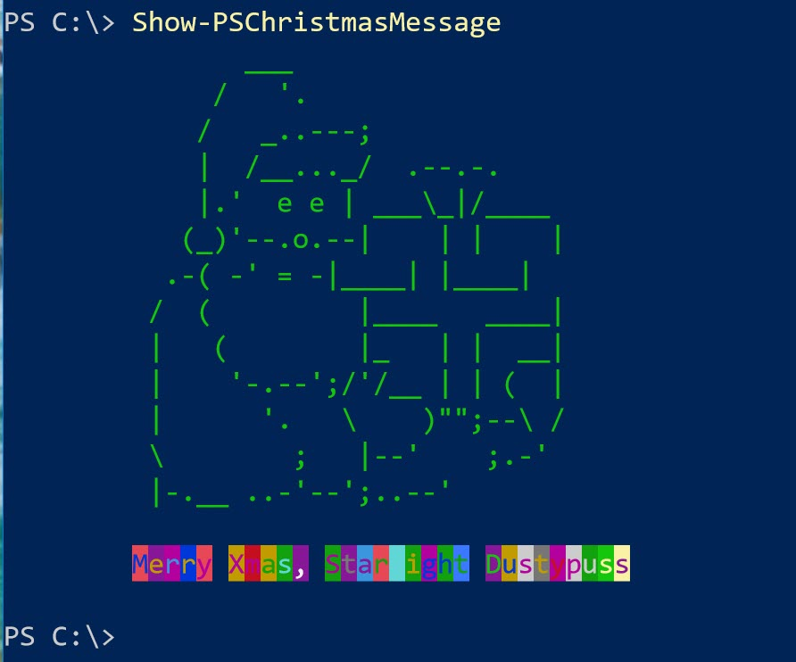

# PSChristmas

[](https://www.powershellgallery.com/packages/PSChristmas/) [](https://www.powershellgallery.com/packages/PSChristmas/)

This project is a demonstration class based PowerShell module. The root module contains a simple enumeration and a class definition. Most of the class methods have been moved to an external set of helper functions.

You can install a release from GitHub or the PowerShell Gallery.

```powershell
Install-Module PSChristmas
```

## Using the Class

In order for the user of the module to not have to understand how to work with objects and classes, the module contains a function to create a new instance of the class called `New-PSChristmas`.

```powershell
$xmas = New-PSChristmas
```

This object will look like this:

```text
Greeting      : Hyvää Joulua
ElfName       : Boris Spicybottom
List          : Nice
ChristmasDay  : Monday
DaysRemaining : 16
CountDown     : 15.14:53:49
```

If you examine the object with `Get-Member` you will see a few methods.

```text
   TypeName: PSChristmas

Name          MemberType Definition
----          ---------- ----------
Equals        Method     bool Equals(System.Object obj)
GetHashCode   Method     int GetHashCode()
GetType       Method     type GetType()
Play          Method     void Play()
Refresh       Method     void Refresh()
Show          Method     void Show()
ToString      Method     string ToString()
CountDown     Property   string CountDown {get;set;}
Day           Property   string Day {get;set;}
DaysRemaining Property   int DaysRemaining {get;set;}
ElfName       Property   string ElfName {get;set;}
Greeting      Property   string Greeting {get;set;}
List          Property   ListStatus List {get;set;}
```

However, the user can use the module functions to invoke these methods. The functions are designed to invoke the method from the class.

```powershell
$xmas | Invoke-Jingle
$xmas | Show-PSChristmasMessage
```

## Helper Functions

The module includes several other functions, some of which are exported for the user to manually run.

```powershell
PS C:\> get-command -Module PSChristmas


CommandType Name                     Version Source
----------- ----                     ------- ------
Function    Get-PSChristmasPresent   2.0.0   PSChristmas
Function    Invoke-Jingle            2.0.0   PSChristmas
Function    New-ElfName              2.0.0   PSChristmas
Function    New-PSChristmas          2.0.0   PSChristmas
Function    New-PSChristmasGreeting  2.0.0   PSChristmas
Function    Show-PSChristmasMessage  2.0.0   PSChristmas
Function    Write-Festive            2.0.0   PSChristmas

```

One benefit of having external functions is that they are easier to test with something like Pester or update without having to modify the class definition.

## Data

Some of the functions rely on text lists and randomization. Those lists have been moved to a json file. The json file is imported in the module and turned into an object.

The json file is encoded with Unicode to support different language characters. Be careful opening the file where the encoding my change.

```powershell
$xmasData = Get-Content .\data.json | ConvertFrom-Json
```

The data can then be used in a function like this:

```powershell
$presents = $xmasData.presents | Get-Random -count $Count
```

One benefit of using the json file as opposed to an enumeration is that the latter doesn't like spaces in the values. But using a format like json allows entries like "coloring book". In addition, if you wanted to add more entries, you only have to modify the json file and not any of the code.

If you look at the module folder you'll also see a script called `BuildJsonFile.ps1` which will create the json file for you based on settings within the file.

The variable, `xmasData` is exported to your PowerShell session so you can work with it.

### Note

Previous versions of this module used a noun and class name of *myChristmas*. I kept thinking about these commands as *PSChristmas* so I changed the references. This is a silly educational module so I'm not expecting I broke anyone's holiday production scripts.

### Credits

The functions to display the holiday graphics and play the tune are things I've collected since the earliest days of PowerShell. I wish I could remember who created all of them. I seem to recall "repurposing" at least from Lee Holmes, Hal Rottenberg and MoW.



The [class](http://bit.ly/2gTxigI) and [module]("http://bit.ly/2gYjXUc) are also described on my [blog](https://jdhitsolutions.com/blog)

*Last Updated 24 December 2019*